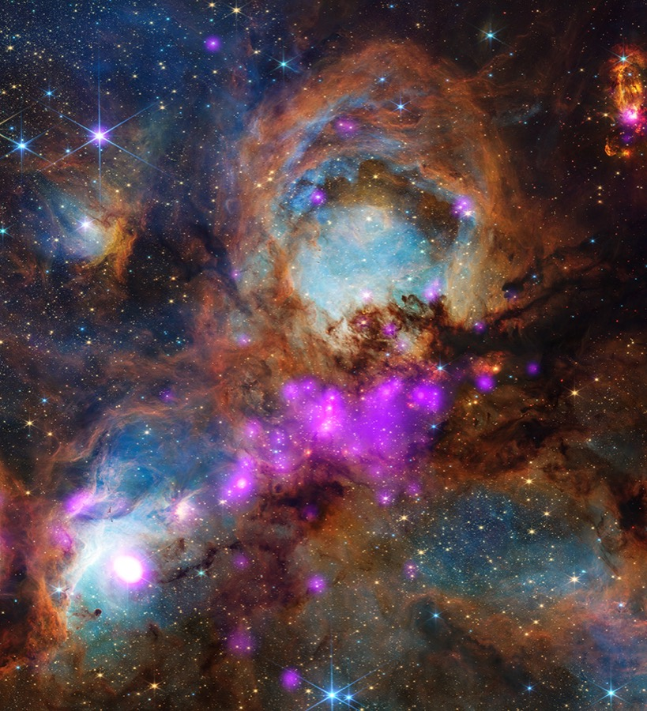

# JWST Image Pipeline

**Author:** RK

A local pipeline that pulls James Webb Space Telescope photos from Flickr, extracts deep learning features, and trains image classifiers to categorise JWST imagery by subject type.


*Cat's Paw Nebula (NGC 6334) — Webb + Chandra. Classified: **nebula**.*

---

## What it does

1. **Ingest** — downloads JWST photos from the NASA Webb Flickr account into DuckDB
2. **Embed** — runs each image through ResNet50 to produce a 2048-dim feature vector
3. **Label** — maps Flickr tags to canonical subject classes (nebula, galaxy, star, etc.)
4. **Train** — fits an XGBoost classifier on the embeddings; also fine-tunes ResNet50 end-to-end
5. **Predict** — runs inference on new photos, storing predictions back to DuckDB

Predictions with confidence below 0.6 are stored as `unclassified` rather than forced into a wrong class.

---

## Stack

- **Orchestration:** Apache Airflow ([Astro CLI](https://docs.astronomer.io/astro/cli/overview))
- **Storage:** DuckDB
- **ML:** PyTorch (MPS / Apple Silicon), XGBoost, scikit-learn
- **Features:** ResNet50 `IMAGENET1K_V2` → 2048-dim embeddings
- **Source:** Flickr API, `nasawebbtelescope` account

---

## Quick start

**Prerequisites:** macOS (Apple Silicon), [Astro CLI](https://docs.astronomer.io/astro/cli/install-cli), Docker Desktop, Flickr API key.

```bash
# 1. Clone
git clone https://github.com/RK-A1/JWST.git && cd JWST

# 2. Add your Flickr API key
echo "FLICKR_API_KEY=your_key_here" > .env

# 3. Start Airflow (http://localhost:8080 — admin / admin)
astro dev start

# 4. Run the pipeline in order
astro dev run airflow dags trigger jwst_flickr_ingest
astro dev run airflow dags trigger jwst_feature_extraction
python include/tag_consolidation.py
astro dev run airflow dags trigger jwst_train_classifiers
```

Inference runs automatically at the end of each ingest.

---

## Project layout

```
dags/
  jwst_flickr_ingest.py        # download photos + run inference
  jwst_feature_extraction.py   # ResNet50 embeddings
  jwst_train_classifiers.py    # XGBoost + fine-tuned ResNet
include/
  db.py                        # DuckDB connection + schema
  tag_consolidation.py         # Flickr tags → canonical labels
  images/                      # downloaded images (gitignored)
  models/                      # model checkpoints (gitignored)
  jwst.duckdb                  # database (gitignored)
assets/
  example_nebula.jpg           # sample image used in this README
```

---

## Database schema

```sql
photos (photo_id, title, description, tags, image_path,
        date_taken, date_ingested,
        embedding FLOAT[],       -- 2048-dim ResNet50 vector
        canonical_label TEXT,    -- ground truth from tag consolidation
        predicted_label TEXT)    -- model output

training_runs (run_id, ts, model_type, accuracy, f1_score, model_path)
```

---

## Useful queries

```bash
# Photo counts by predicted class
duckdb include/jwst.duckdb \
  "SELECT predicted_label, count(*) n FROM photos GROUP BY 1 ORDER BY 2 DESC"

# Accuracy vs ground truth
duckdb include/jwst.duckdb \
  "SELECT round(100.0 * sum(predicted_label = canonical_label) / count(*), 1) AS pct_match
   FROM photos WHERE canonical_label IS NOT NULL AND predicted_label IS NOT NULL"
```
